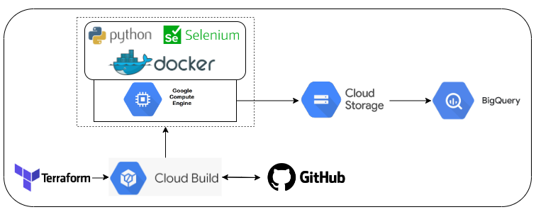

# Projeto de Engenharia de Dados: WebScraping

## Introdução

Dentro do ambiente de trabalho de um engenheiro de dados, podem existir situações nas quais se torna necessário realizar a coleta de dados de algum site ou aplicação, na qual não é possível utilizar uma API ou ter acesso direto ao banco de dados. Nessas circunstâncias, recorre-se ao web scraping. 

Este projeto tem como objetivo realizar web scraping do site do Airbnb, coletando dados sobre imóveis em uma determinada localidade e período de tempo específico. O processo de scraping será conduzido no ambiente de nuvem do Google Cloud Platform (GCP), executado em uma máquina virtual. 

## Tecnologias Utilizadas

- **Artifact Registry:** repositório de imagens do docker.
- **Cloud Build:** Servico que possibilita implementar o deploy automatico da infraestrutura na nuvem, funcionando de forma integrado ao GitHub. 
- **Docker:** Utilizado para criar a imagem contendo o código da aplicação. 
- **Terraform:** Ferramenta que permite o provisionamento eficiente de toda a infraestrutura necessária, seguindo a metodologia de Infraestrutura como Código (IaC). 
- **Selenium:** biblioteca do python que permite interagir com o site e realizar a raspagem.
- **GitHub:** Repositório responsável pelo versionamento do codigo, sendo também o gatilho do Cloud Build sempre que sofrer novas alterações. 
- **Cloud Storage:** Um ambiente na nuvem que permitirá armazenar os arquivos parquet que são o resultado da raspagem.
- **Big Query:** Um sistema de armazenamento na nuvem no qual será consumido os dados de resultado do webscraping.

 

 

    

## Arquitetura

## Etapas do Projeto

### 1. Desenvolvimento do Código para Web Scrapping: 

A primeira etapa do projeto consiste em desenvolver um código capaz de realizar o web scraping do site do Airbnb, para isso será utilizado a linguagem de programação python, amplamente utilizada na engenharia de dados. Para a realização da raspagem do site, é necessário realizar algumas interações, como clicar em alguns links e rolar a página, para isso será utilizado a biblioteca selenium.

Para localizar os elementos HTML, será utilizado caminhos XPath das divs. Esses caminhos serão armazenados em um arquivo YAML externo para facilitar atualizações futuras, sem a necessidade de modificar o código diretamente, visto ser comum ocorrem atualizações na aplicação web, modificando os caminhos anteriores.

O resultado do scrapping é uma tabela anúncios com uma listagem de imoveis do airbnb contendo informação de notas, valores, quantidade de comentários e etc, junto da tabela acomodações que armazena os beneficios que aquele imovel pode apresentar. Todas as tabelas são salvas no cloud storage com o formato parquet, visto sua alta capacidade de compressão.

### 2. Criação do Dockerfile

Com o código da aplicação funcionando, é preciso dockerizá-lo para evitar problemas de dependências ao executá-lo em uma máquina virtual. Para isso, criaremos um arquivo Dockerfile {colocar link do arquivo} que utilize uma imagem base Python, juntamente com um arquivo de requisitos contendo todas as bibliotecas e suas respectivas versões. 

### 3. Provisionamento da infraestrutura da VM usando Terraform

Com a imagem Docker configurada, é hora de provisionar a máquina virtual capaz de executar o código da aplicação, utilizando Terraform para realizar esse provisionamento. Basicamente, é criado uma máquina virtual no GCP que, ao ser iniciada, executará alguns comandos para instalar o Docker, permitindo eventualmente a execução do container com o código da aplicação. Esse provisionamento é realizado manualmente, uma única vez, por meio do Terraform, não sendo necessário recriar a máquina virtual em caso de mudanças no código. 

### 4. Cloud Build

Embora a máquina virtual seja provisionada apenas uma vez, a imagem do container precisa ser atualizada sempre que houver mudanças no código. Para isso, cria-se um repositório no GitHub contendo o código da aplicação e configura-se uma trigger no Cloud Build. Sempre que houver um commit na branch main, comandos no cloudbuild.yaml serão executados para montar a imagem Docker a partir do Dockerfile e enviá-la para o Artifact Registry (repositório de imagens docker do GCP). A VM usará sempre a última versão da imagem, garantindo a execução do código mais recente. 

### 5. Executando a aplicação

Com a máquina virtual provisionada e o Cloud Build configurado, basta conectar à instância via SSH e executar o comando docker run com os parâmetros de localidade e datas para realizar o scraping. Como o scraping pode ser executado em qualquer cidade e data, não há necessidade de programar sua execução periodicamente, sendo uma atividade esporádica, sob demanda. 

### 6. Executando a aplicação

Toda vez que a aplicação é executado ela salva o retorno do scrapping em um bucket do Cloud Storage, para ao consumo deste dados é possível criar uma tabela externa no Big Query, que permite realizar consultas dentro do Big Query diretamente no Cloud Storage.

## Pré-Requisitos

Para execução do codigo é necessário possuir terraform instalado na máquina local, uma conta no GCP com criação de um usuário de serviço com acesso a todos os servicos mencionados no projeto.

## Executando o Projeto

Copie o diretório do projeto para uma pasta local em seu computador.
1. Abra o terminal do seu computador e mova até o diretório do projeto.
2. Crie uma conta de servico no GCP com a credencias a todos os serviços mencionados, baixe uma chave em um arquivo json e coloque o arquivo no diretório build com nome gcp_account.json
3.  Mova para pasta /build/virtual_machine e execute os comandos: `terraform init`, `terraform plan`, `terraform apply`.
4. Crie um arquivo json github_token.json, e crie uma chave github_token com o respectivo token da sua conta do github.
5. Vá ao arquivo variaveis do terraform e subsitua pelos seu respectivo valores.
6. Crie um repositorio no git hub e suba todo o codigo do projeto.
7. Mova para pasta /build/trigger e execute os comandos: `terraform init`, `terraform plan`, `terraform apply`, sempre que for feito um novo commit a infraestrutura sera executada.
8. Entre por SSH na máquina virtual e execute o scrapping utilizando o `docker run us-central1-docker.pkg.dev/enduring-branch-413218/web-scrap/web-scrap-image  -- localização –data_inicio –data_fim –qtde_adultos –qtde_criancas –qtde_bebes --qtde_pets`

